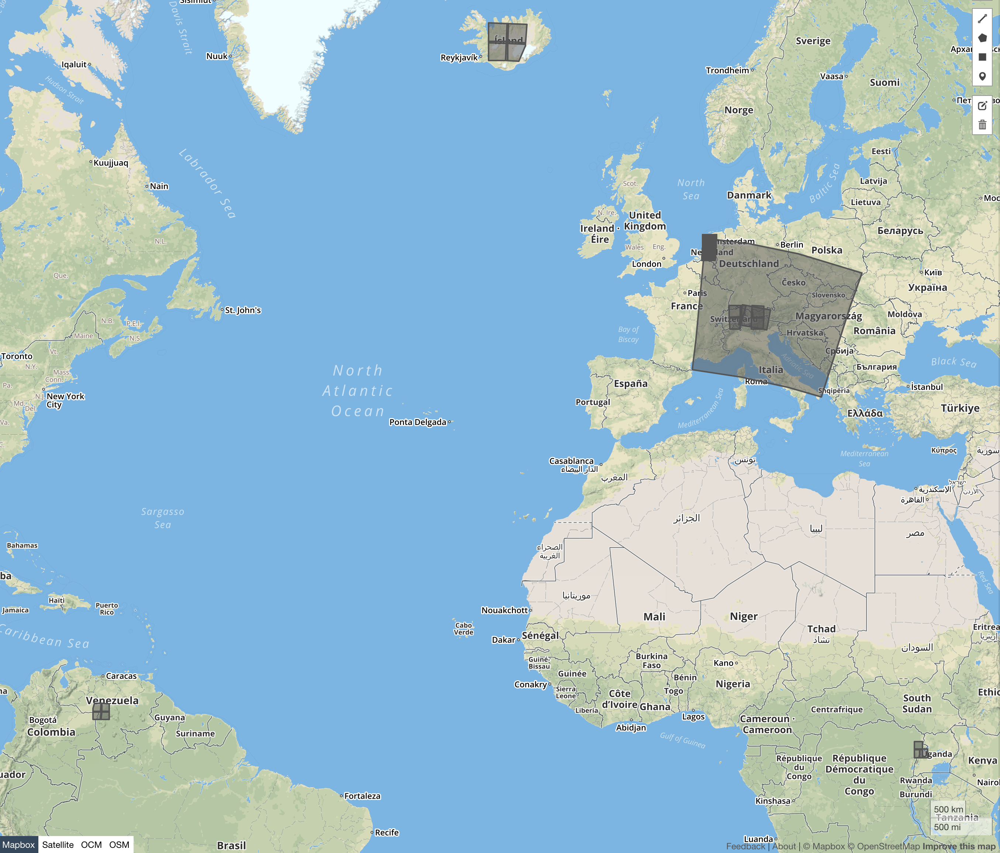

# Sentinel reference dataset for the OpenEO backend validation

The aim of this dataset is to have a common base of data to validate the OpenEO processes. It consists of Sentinel 1, 2 and 3 data.

## Overview


<p style="text-align: center;">The spatial extent of the reference data.</p>

## Unique identifiers

The uids are stored inside uids.txt and delimited by a newline. They can also be retrieved from the ReferenceData.json. The JSON and GeoJSONs are not updated for the added Sentinel 1 tiles. 

Json:
```json
{
    "referenceDatasets": {
        "Sentinel-1": {
            "uids": ["ed5c9c38-b8a4-4744-8c8f-b9a9258c90e9"],
            "size": "1.62 GB"
        },
        "Sentinel-2": {
            "Single": {
                "Switzerland": {
                    "uids": ["acfc1852-ab3a-460a-93eb-bae846fd05da", "62096380-ea68-42f1-b02d-fa34b611b754", "88605485-103e-4b7f-b1a4-871654c7f230", "49066a33-6a09-4df5-828b-9f3aebda4311"],
                    "size": "2.33631 GB",
                    "processinglevel": "Level-2A"
                },
                "Italy": {
                    "uids": ["9102386a-83e2-4bad-9e46-e2dec76bd6a4", "650c2e15-532c-482a-a652-34ecc83c713e", "bbee7dab-ddb8-4921-87e1-7bcacec50971"],
                    "size": "2.27787 GB",
                    "processinglevel": "Level-2A"
                },
                "Island": {
                    "uids": ["98a9078c-73ca-4756-9772-658fdc615e17", "7803fe25-4aa9-469b-aa61-362f7d595716", "119fa1d8-b16f-435c-9e67-0fd863999e4e", "dbdbb712-58ee-4870-ad96-66ec8afe257a"],
                    "size": "4.02646 GB",
                    "processinglevel": "Level-2Ap"
                },
                "Uganda": {
                    "uids": ["d177067c-0768-4c5f-9c9d-a463a5821fb9", "eeac9b7b-814c-4a90-b486-d94180494d2f", "782f5fbc-29ae-46c2-bd39-c9971ddbb241"],
                    "size": "3.12367 GB",
                    "processinglevel": "Level-2A"
                },
                "Venezuela": {
                    "uids": ["ea6c82a8-4d7e-4591-83e9-8d0df2d95836", "29db6674-3f20-4c8f-a812-9b27fab32d6c", "1d40958a-4f13-41ec-8643-e9758a21a2ff", "bea90e72-a69f-458f-9e3b-1e3e5dbfd144"],
                    "size": "3.01695 GB",
                    "processinglevel": "Level-1C"
                }
            },
            "Timeseries": {
                "Netherlands": {
                    "uids": ["86b3f68a-6352-427b-8b0a-b9fcc15f83de", "687c314d-e9e4-4f03-a523-5d1bb47d71f6", "7f66c53e-09c8-4e53-9b94-92dab1daa3cc", "edd49211-af4c-44fd-af8d-992eedacd166", "c0dd1313-dbbc-4887-9a7b-3cee9e803ab1", "11bb5236-f8ee-498e-b647-574455d00f09", "c0ebdc4f-a663-490c-8560-29363bb0499d", "c5722a25-e7c7-47e9-804c-cb7cc139aa88", "7d4644df-687c-45b9-9c21-288d9b46d1ed", "c0357c6d-3910-423a-883e-755e6ffba398", "3e8bbcd8-af88-467b-9172-888057959567", "c0ca6cbb-6748-4fbb-9ab3-0b156caf1983", "d40f811a-e1a1-4967-a490-ab675e65f19e", "4bb51557-3450-43bd-8601-fb80ccf2064c", "099126c8-fada-44e8-9f72-2d13841645bc", "4bc16fb9-4204-495f-bcd5-84a6d4bba819", "2a5051f2-aa40-4e4d-b096-e39d5ce5ba3a", "d37d8249-60b3-490c-974e-bd2b0f615393", "4e777a0c-69fd-4a0b-833e-5b679536b6eb", "f813f941-5e71-43ea-9074-fd26c99e580a", "6e9f4501-ff9f-43b4-bf38-50623f4166ab", "22306801-c9b5-4163-9c03-ab81e1f94478", "0fd9f6e8-0a7f-4a0d-bf71-94806ade35a9", "350b9656-05b0-4633-aeca-6723c9453a29", "3e4d1a09-9d91-4220-af04-2f83e65455be", "8633e2bd-aff9-480f-a93d-78c83c861395", "84a8fa8e-bbb8-4cfd-b8d8-d315de866012", "d91bf4ca-f416-4c62-a89a-34628132826d", "7b65afda-3dfd-4f90-beb4-e2749e3c9087", "89b94f10-b0ef-4b7b-87b8-944649b27ebc", "ea13b78d-ac33-4035-98eb-3fa41355590f", "1876e921-b852-4eae-9d8f-df29bcd2484d", "74c25daa-514d-46c7-8514-163a57e86419", "8253bbbf-e28f-416c-9dd6-9858c564f747", "b3dfab9d-759a-4707-916f-48c9e0045896", "1a95ed79-0d29-4384-bfe3-c95196bc0e1e", "b8275cd6-ffc9-4109-8f5e-f256c575ab57", "2e7d2a54-05d8-42d9-8868-ff2cee1d4bd9"],
                    "size": "35.15352 GB",
                    "processinglevel": "Level-2A"
                }
            }
        },
        "Sentinel-3": {
            "uids": ["a86b6494-0dfc-4ccf-842b-7c06e3831723"],
            "size": "0.69151 GB"
        }
    }
}
```

## Geojsons

To improve access I added geojsons for Sentinel 2 data. This way one can inspect the data more quickly.

## Download

The tiles can be downloaded with the sentinelsat CLI or the Python API (https://github.com/sentinelsat/sentinelsat)
Documentation: <https://sentinelsat.readthedocs.io/en/stable/cli.html#quickstart>

### Python

A python and bash script is made available in this repository. These scripts download all tiles using the uid stored inside the *uids.txt*. Both scripts require input parameters and login credentials from https://scihub.copernicus.eu/

```python
python download_reference_data.py <targetfolder> <user> <password> 
```

### Bash 
```bash
sh download_reference_data.sh uids.txt <user> <password>
```

### CLI 
To download single files, the CLI is a great choice.

Single tile with one unique id. 
```bash
sentinelsat -u <user> -p <password> --uid acfc1852-ab3a-460a-93eb-bae846fd05da -d 
```

Multiple tiles:
```bash
sentinelsat -u <user> -p <password> --uuid acfc1852-ab3a-460a-93eb-bae846fd05da,62096380-ea68-42f1-b02d-fa34b611b754
```
